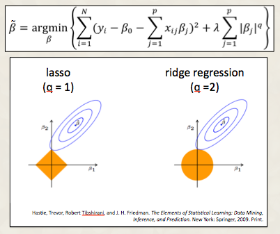

# CU-BDA-Lab01

**Name**: Ariel Chan  
**Major**: Plant Breeding and Genetics   
**Student Status**: Graduate Student (3rd year)  

**Interests**:  

* imputation  
* large-*p*, small-*n* problems
* analysis and modeling of stochastic processes, particularly those related to the field of genetics and genomics

Evaluating Imputation Algorithms for Low-Depth Genotyping-By-Sequencing Data

		Genomic selection (GS), a breeding method that promises to increase the rate of genetic gain, requires dense genome-wide marker data. For species that lack a complete reference genome or predesigned single nucleotide polymorphism (SNP) genotyping arrays, Genotyping-By-Sequencing (GBS) offers an inexpensive approach for obtaining genome-wide markers via low-coverage genotyping. This method results in high levels of missing data across samples; however, the intrinsic structure in the genotype data can be used to infer or impute missing genotypes. Accurate imputation therefore increases the value of low-cost, low-depth genotyping.  
		Accurate imputation algorithms exist but were largely developed for human genetics, where SNP arrays are the common genotyping platform. Data generated from SNP arrays and GBS differ substantially. To assess the applicability of these algorithms in crop species, we evaluated their performance in the context of GBS-type data. We compared two imputation methods: Beagle v.4 and LASSO-penalized, multiple linear regression. To calculate imputation accuracy, we masked a subset of known genotypes, imputed, and calculated the correlation between the true and imputed genotype values. We also examined the factors affecting imputation accuracy for each method. The results of this study will be published next year. 


